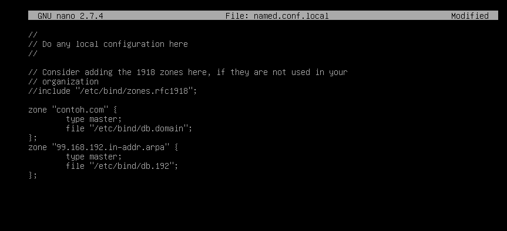

## DNS SERVER
A custom DNS server setup script created by Vinosbrr, designed to automate the configuration of a basic DNS server environment on Debian 9 using a virtual machine. This project is experimental and intended for educational or testing purposes only.
 
## What is a DNS Server?
DNS (Domain Name System) is the system that translates human-readable domain names like example.com into IP addresses such as 192.0.2.1, which computers use to communicate with each other.A DNS server works like the "phonebook" of the internet, making sure users are directed to the correct server when they enter a domain name.

Core components of a DNS server:
BIND9: One of the most widely used open-source DNS server software.
Zone Files: Define domain-to-IP mappings.
Forward and Reverse Lookup Zones:
Forward: Domain name → IP address
Reverse: IP address → Domain name

## Information

<div align="center">
<a href="https://github.com/vinosbrr/Sbrr-Bot/watchers"></a>
<a href="https://github.com/vinosbrr/Sbrr-Bot/network/members"></a>
<a href="https://github.com/vinosbrr/Sbrr-Bot/stargazers"></a>
<a href="https://github.com/vinosbrr/Sbrr-Bot/issues"></a>
<a href="https://github.com/vinosbrr/Sbrr-Bot/issues?q=is%3Aissue+is%3Aclosed"></a>
<a href="https://github.com/vinosbrr/Sbrr-Bot/pulls"></a>
<a href="https://github.com/vinosbrr/Sbrr-Bot/pulls?q=is%3Apr+is%3Aclosed"></a>
</div>


This script was developed by [Vinosbrr](https://github.com/vinosbrr) using a Virtual Machine environment with the Debian 9 ISO and the "brain" library. It is currently an experimental project and may include unexpected behavior. Users are encouraged to test and explore its features, but it is not recommended for use in production environments.

If you encounter persistent issues, feel free to contact the developer. Contributions, suggestions, and improvements are welcome. Please make sure to review the license before using or modifying this script. ~ By Vinosbrr
> © Developed by Vinosbrr 2025

## Contributor
- [Vinosbrr](https://github.com/vinosbrr) (Developer)


---
## Disclaimer
[ RECOMMENDED INSTALL ON VIRTUAL MACHINE ]
This project is provided as-is and is still in an experimental phase. Not recommended for production use. For questions, feedback, or bug reports, please contact the developer.
> © Developed by Vinosbrr 2025
```bash
Debian 9 DVD 1,2,3.ISO
```

---
### Preparation All Packages Before 
- DVD 1,2,3 (Cdrom add) 
- Network (IPv4)

---
## BIND9 Configuration
Sebelum memulai instalasi dns server, disarankan untuk menyiapkan terlebih dahulu sebuah domain khusus yang akan digunakan dalam proses konfigurasi. Pada contoh kali ini, domain yang digunakan adalah contoh.com. yang dikonfigurasi secara lokal menggunakan layanan DNS dari BIND9.

---
###  Konfigurasi BIND9 <<
[ 1.1 Update Repository dan install Package bind9 ]
```bash
apt update
apt install bind9
```

[ 1.2 Setelah Installasi masuk directory /etc/bind dan edit file named.conf.local ]
named.conf.local adalah bagian dari konfigurasi BIND9 yang digunakan untuk mendeklarasikan zona DNS lokal. Di sini kita mendefinisikan nama domain apa yang akan di-handle oleh server, dan file zona mana yang digunakan untuk masing-masing domain tersebut
```bash
cd /etc/bind
nano named.conf.local
```


[ 1.3 copy file lokal dan edit file ]
```bash
cp db.domain
cp db.ip
nano db.domain
```
File db.domain digunakan untuk menerjemahkan nama domain menjadi alamat IP. Di dalam file ini, terdapat beberapa record penting. Record SOA (Start of Authority) berisi informasi utama tentang zona, seperti nama domain utama dan alamat email administrator. Record NS (Nameserver) menunjukkan server DNS yang mengelola domain tersebut. Record A (Address) memetakan subdomain seperti www atau mail ke alamat IP tertentu. Selain itu, terdapat juga record MX (Mail Exchange) yang menunjukkan server email untuk domain tersebut.

```bash
nano db.192
```
file db.ip digunakan untuk menerjemahkan alamat IP menjadi nama domain. File ini biasanya digunakan untuk keperluan reverse DNS lookup. Di dalam file ini, terdapat record PTR (Pointer) yang memetakan alamat IP tertentu ke nama domain yang sesuai. Misalnya, alamat IP 192.168.56.10 dapat dipetakan ke nama domain ns1.dns.contoh.com. Konfigurasi ini penting untuk memastikan bahwa server DNS dapat melakukan pencarian terbalik (reverse lookup) dengan benar.


### Konfigurasi Resolv.conf
```bash
nano /etc/resolv.conf
```
```bash
search contoh.com
nameserver 192.168.99.1
```
[ 1.4 Restart bind9 ]
```bash
systemctl restart bind9
cd
```
### Testing bind9 menggunakan dnsutils
Uji coba ​bind9 dengan nslookup, dnsutils adalah kumpulan utilitas baris perintah di sistem operasi berbasis Linux yang digunakan untuk melakukan query dan mendiagnosis masalah terkait Domain Name System (DNS). Paket ini sering terinstal secara default pada distribusi seperti Debian dan Ubuntu
```bash
apt install dnsutils
nslookup contoh.com
nslookup mail.contoh.com
nslookup 192.168.99.1 
```
Selanjutnya jika berhasil akan muncul seperti gambar berikut

### Testing
Selanjutnya buka web browser pada sisi client dan masukkan domain dari mail server, maka akan muncul interface dari roundcube. Lalu login menggunakan salah satu user yang telah dibuat.

> Developed by Vinosbrr
---
### Connection Options
- Support cmd
- Support nslookup

---
### Features 
- Automates mail server installation steps
- Configures essential services (Postfix, Dovecot, etc.)
- Uses Debian 9 base system for compatibility
- Lightweight and easy to modify

### Requirements
- Virtual Machine (VMware/VirtualBox)
- Debian 9 ISO installed
- Root access or sudo privileges
- Basic knowledge of Linux and shell scripting
  
---
License: [MIT License](../LICENSE)

#### Support Me
- [Instagram](https://www.instagram.com/vinosbrr?igsh=MWJ6dXU1eXdzdWcwbw==)
- [Group WhatsApp](https://chat.whatsapp.com/KZmCzNMege942CH7qa7176)
- [Youtube](https://youtube.com/@wongesbrr?si=RQbf8_FRIju8ACCU)


## Thanks to
| [](https://github.com/vinosbrr)
| --- | 
| [Vinosbrr](https://github.com/vinosbrr) |
> © Developed by Vinosbrr 2025


