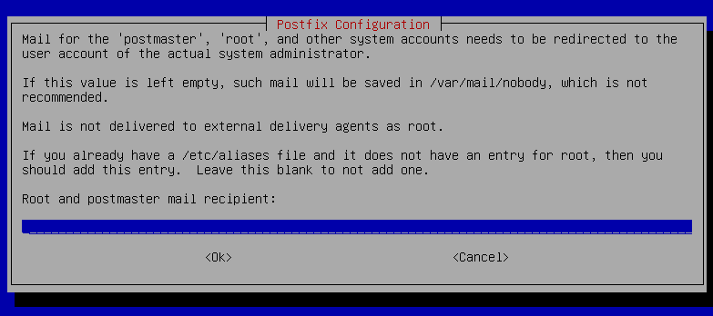
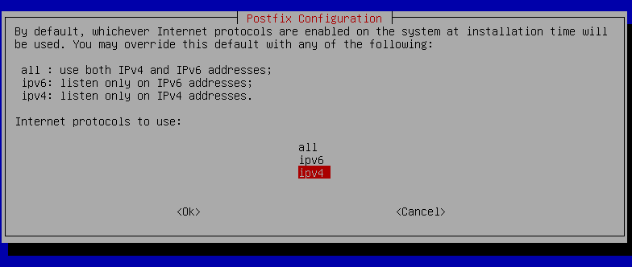
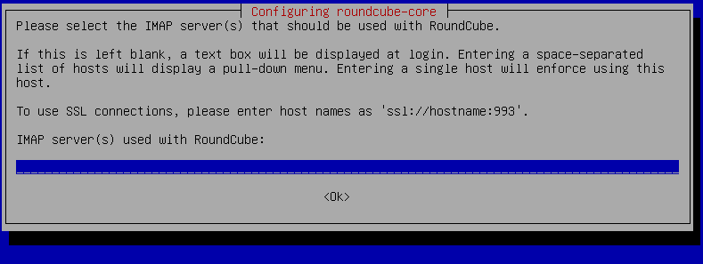
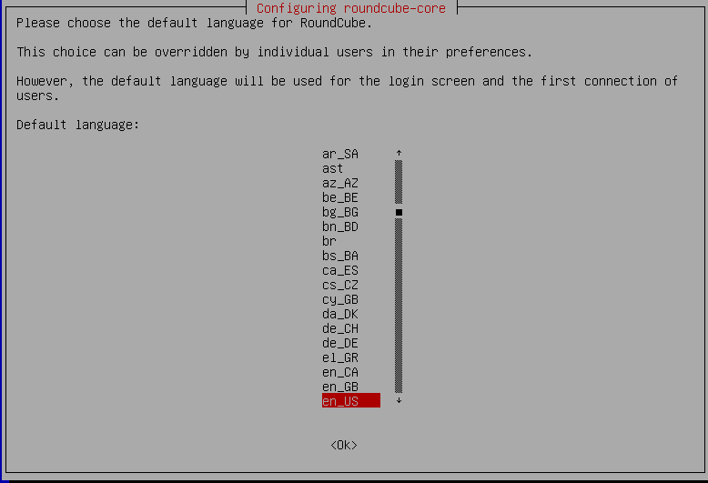
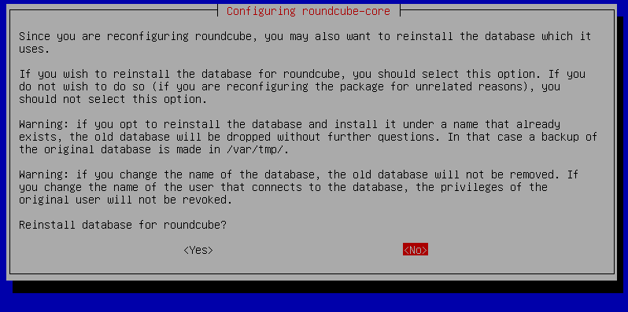
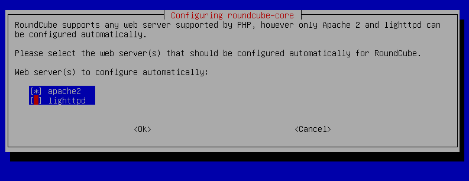
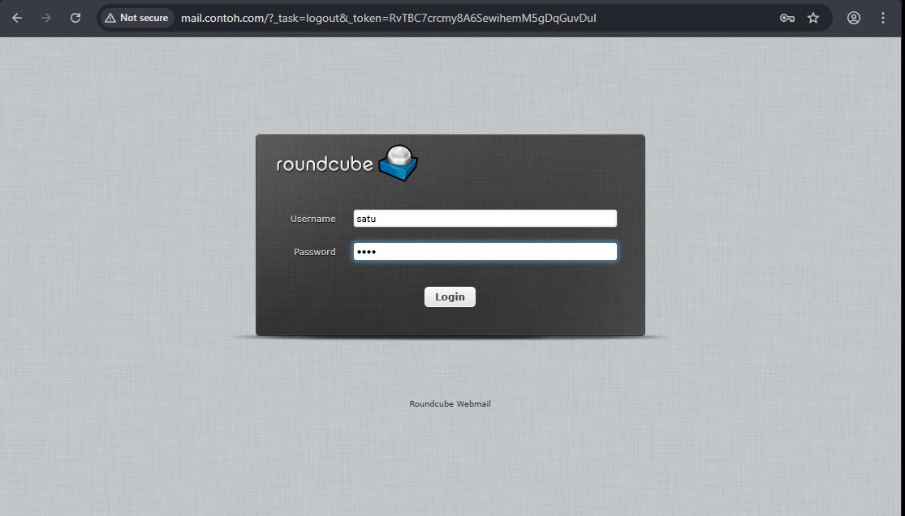
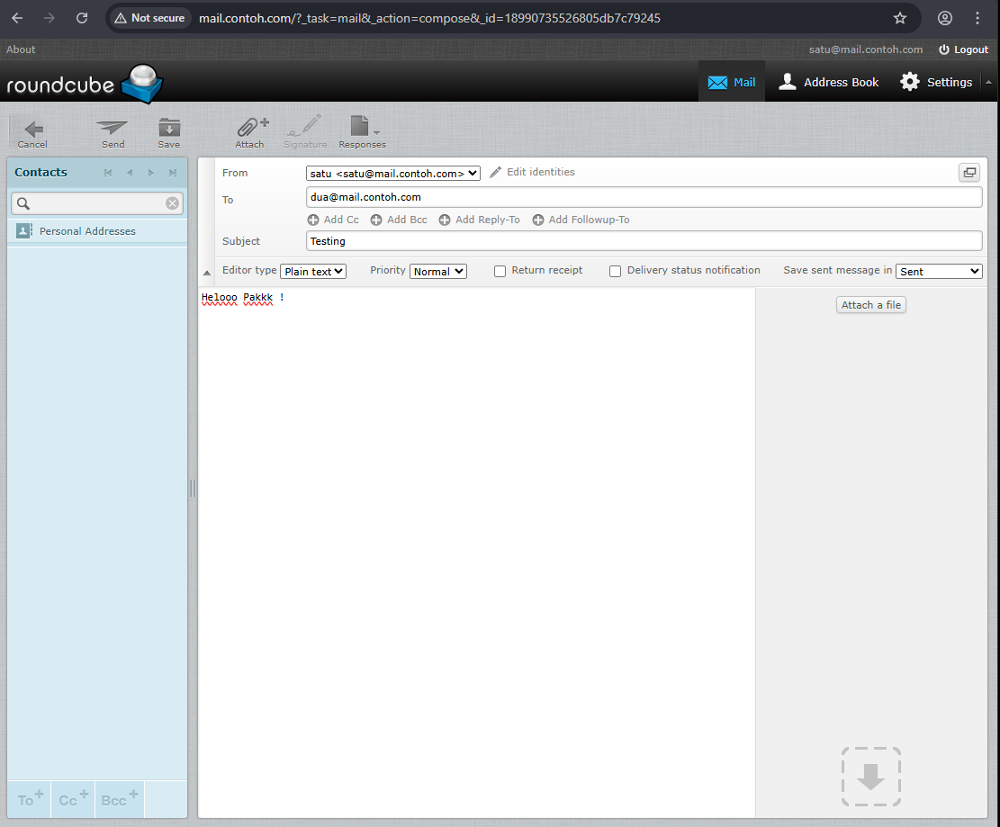
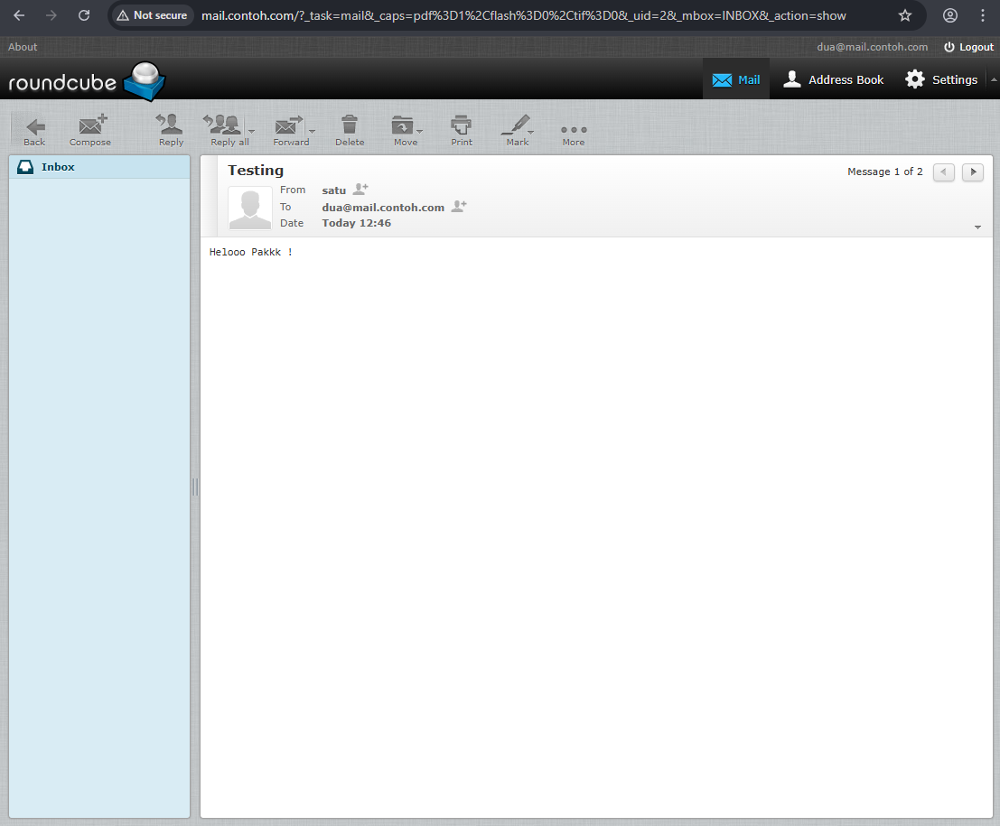

# MAIL SERVER
A custom mail server setup script created by Vinosbrr, designed to automate the configuration of a basic mail server environment on Debian 9 using a virtual machine. This project is experimental and intended for educational or testing purposes only.
## What is a Mail Server?
- A mail server is a system responsible for sending, receiving, and storing email. It consists of components such as:
- SMTP (Simple Mail Transfer Protocol): Sends outbound email (e.g., Postfix).
- IMAP/POP3: Retrieves incoming email (e.g., Dovecot).
- MTA (Mail Transfer Agent): Routes messages between mail servers. Mail servers are essential for communication in personal, corporate, and enterprise networks.
This project aims to help users understand and build a functioning mail server from scratch using open-source tools and manual configuration.

## Information

<div align="center">
<a href="https://github.com/vinosbrr/Sbrr-Bot/watchers"></a>
<a href="https://github.com/vinosbrr/Sbrr-Bot/network/members"></a>
<a href="https://github.com/vinosbrr/Sbrr-Bot/stargazers"></a>
<a href="https://github.com/vinosbrr/Sbrr-Bot/issues"></a>
<a href="https://github.com/vinosbrr/Sbrr-Bot/issues?q=is%3Aissue+is%3Aclosed"></a>
<a href="https://github.com/vinosbrr/Sbrr-Bot/pulls"></a>
<a href="https://github.com/vinosbrr/Sbrr-Bot/pulls?q=is%3Apr+is%3Aclosed"></a>
</div>


This script was developed by [Vinosbrr](https://github.com/vinosbrr) using a Virtual Machine environment with the Debian 9 ISO and the "brain" library. It is currently an experimental project and may include unexpected behavior. Users are encouraged to test and explore its features, but it is not recommended for use in production environments.

If you encounter persistent issues, feel free to contact the developer. Contributions, suggestions, and improvements are welcome. Please make sure to review the license before using or modifying this script. ~ By Vinosbrr
> © Developed by Vinosbrr 2025

## Contributor
- [Vinosbrr](https://github.com/vinosbrr) (Developer)


---
## Disclaimer
[ RECOMMENDED INSTALL ON VIRTUAL MACHINE ]
This project is provided as-is and is still in an experimental phase. Not recommended for production use. For questions, feedback, or bug reports, please contact the developer.
> © Developed by Vinosbrr 2025
```bash
Debian 9 DVD 1,2,3.ISO
```

---
### Preparation All Packages Before 
- DVD 1,2,3 (Cdrom add) [Click Here](../cd-dvd)
- Network (IPv4) [Click Here](../ipv4)
- Web Server (Apache2) [Click Here](../web-server)
- DNS Server (Bind9) [Click Here](../dns-server)


---
## Postfix and Dovecot Configuration
Sebelum memulai instalasi mail server, disarankan untuk menyiapkan terlebih dahulu sebuah domain khusus yang akan digunakan dalam proses konfigurasi. Pada contoh kali ini, domain yang digunakan adalah mail.contoh.com. yang dikonfigurasi secara lokal menggunakan layanan DNS dari BIND9.

---
###  Konfigurasi Postfix <<
[ 1.1 Update Repository dan install Package Postfix ]
```bash
apt update
apt install postfix dovecot-imapd dovecot-pop3d
```
Setelah proses instalasi selesai, akan muncul sebuah jendela konfigurasi (message box). Pada tahap ini, pilih opsi Internet Site agar mail server dapat berkomunikasi menggunakan protokol SMTP secara langsung untuk pengiriman email.


Selanjutnya masukkan nama domain yang digunakan.


[ 1.2 Setelah Installasi edit file ]
```bash
nano /etc/postfix/main.cf
```
```bash
....
inet_interfaces = all
inet_protocols = all

#tambahkan baris berikut pada baris paling bawah
home_mailbox = Maildir/
```
[ 1.3 Buat mail directory di directory /etc/skel dan masukkan perintah ]
```bash
cd /etc/skel
maildirmake.dovecot /etc/skel/Maildir
ls
dpkg-reconfigure postfix
```
Selanjutnya, akan muncul beberapa pilihan dan kolom input yang perlu diisi. Sesuaikan pengisian tersebut dengan topologi jaringan, konfigurasi sistem, serta kebutuhan mail server yang akan dibangun, agar layanan dapat berjalan secara optimal.







[ 1.4 Restart Postfix ]
```bash
systemctl restart postfix
cd
```
###  Konfigurasi Dovecot >>
[ 2.1 Edit file konfigurasi /etc/dovecot/dovecot.conf & Uncomment pada baris ]
```bash
nano /etc/dovecot/dovecot.conf
...
# If you want to specify non-default ports or anything more complex,
# edit conf.d/master.conf.
listen = *       # Uncomment baris ini
......
```
[ 2.2 Edit file konfigurasi /etc/dovecot/conf.d/10-auth.conf & Uncomment, yes = no ]
```bash
nano /etc/dovecot/conf.d/10-auth.conf
...
# connection is considered secure and plaintext authentication is allowed.
# See also ssl=required setting.
disable_plaintext_auth = no     # Uncomment baris ini, ganti yes ke no
...
```
[ 2.3 Edit file konfigurasi /etc/dovecot/conf.d/10-mail.conf & Uncomment, Comment ]
```bash
nano /etc/dovecot/conf.d/10-mail.conf
...
mail_location = maildir:~/Maildir       # Uncomment baris ini
...
...
# mail_location = mbox:~/mail:INBOX=/var/mail/%u   # Beri comment baris berikut
...
```
[ 2.4 Restart Dovecot ]
```bash
systemctl restart dovecot
```

---
### Menambahkan user Email 
Tambahkan beberapa akun pengguna beserta kata sandinya menggunakan perintah adduser. Akun-akun ini akan digunakan sebagai user email pada mail server. Pada percobaan kali ini, akan dibuat dua user, yaitu satu dan dua, yang masing-masing dapat digunakan untuk mengirim dan menerima email dalam jaringan lokal.
```bash
adduser satu
adduser dua
```

---
### Restart Postfix dan Dovecot
```bash
systemctl restart postfix dovecot
```

---
### Testing Postfix dan Dovecot menggunakan Telnet
Uji coba pengiriman email dapat dilakukan menggunakan perintah "telnet <nama domain> <port>" dengan menggunakan port 25 (SMTP). Setelah terhubung, masukkan alamat pengirim menggunakan perintah "mail from: "diikuti oleh alamat email pengirim. Kemudian, masukkan alamat penerima dengan perintah "rcpt to: ". Untuk menulis pesan, ketik perintah "data", lalu tekan Enter. Isikan subjek email dengan mengetikkan "Subject: <isi subjek>", tekan Enter, lalu ketik isi pesan yang ingin dikirim. Setelah selesai menulis pesan, akhiri dengan mengetikkan satu titik (.) di baris baru, kemudian tekan Enter untuk mengirim pesan.
```bash
apt install telnet 
telnet mail.contoh.com 25
```
```bash
Trying 192.168.99.1...
Connected to mail.contoh.com.
Escape character is '^]'.
220 debian ESMTP Postfix (Debian/GNU)
mail from: satu@mail.contoh.com
250 2.1.0 Ok
rcpt to: dua@mail.contoh.com
250 2.1.5 Ok
data
354 End data with <CR><LF>.<CR><LF>
Subject: Testing
Hello Pakkk!
.
250 2.0.0 Ok: queued as 7DEAD11DF
quit
221 2.0.0 Bye
Connection closed by foreign host.
```
---
Untuk melihat pesan yang diterima, gunakan perintah "telnet <nama domain> <port>". Setelah terhubung, lakukan proses login dengan mengetikkan perintah "user <nama_user>" lalu tekan Enter, kemudian masukkan kata sandi dengan perintah "pass <password>". Untuk menampilkan daftar pesan yang masuk, gunakan perintah "list" Untuk membaca isi pesan tertentu, gunakan perintah "retr <nomor_pesan>". Setelah selesai, ketik perintah "quit" untuk keluar dari sesi Telnet.
```bash
telnet mail.contoh.com 110
```
```bash
Trying 192.168.99.1...
Connected to mail.contoh.com.
Escape character is '^]'.
+OK Dovecot (Debian) ready.
user dua
+OK
pass 0909
+OK Logged in.
list
+OK 1 messages:
1 436
.
retr 1
+OK 436 octets
Return-Path: <satu@mail.contoh.com>
X-Original-To: dua@mail.contoh.com
Delivered-To: dua@mail.contoh.com
Received: from unknown (unknown [192.168.99.1])
	by debian (Postfix) with SMTP id 7DEAD11DF
	for <dua@mail.contoh.com>; Sun,  20 Apr 2025 16:28:48 +0700 (WIB)
Subject: Testing
Message-Id: <20250420174142.7DEAD11DF@debian>
Date: Sun,  20 Apr 2025 16:28:48 +0700 (WIB)
From: satu@mail.contoh.com

Hello Pakkk!
.
quit
+OK Logging out.
Connection closed by foreign host.
```
---
### Konfigurasi Roundcube
[ 3.1 Install MariaDB dan Roundcube ]
```bash
apt install mariadb-server roundcube
```


[ 3.2 Edit file /etc/roundcube/config.inc.php. isi sesuaikan berikut ]
```bash
nano /etc/roundcube/config.inc.php.
...
// For example %n = mail.domain.tld, %t = domain.tld
$config['default_host'] = 'mail.contoh.com';
...
```
```bash
...
// For example %n = mail.domain.tld, %t = domain.tld
$config['smtp_server'] = 'mail.contoh.com';
...
```
```bash
...
// SMTP port. Use 25 for cleartext, 465 for Implicit TLS, or 587 for STARTTLS (default)
$config['smtp_port'] = 25;
...
```
```bash
...
// will use the current username for login
$config['smtp_user'] = '';
...
```
```bash
...
// will use the current user's password for login
$config['smtp_pass'] = '';
...
```
[ 3.3 Configure ulang ( langkah ini bisa dilewati )]
```bash
dpkg-reconfigure roundcube-core
```






[ 3.4 Edit file /etc/apache2/apache2.conf dan konfigurasi ]
```bash
nano /etc/apache2/apache2.conf
...
#tambahkan baris paling bawah
Include /etc/roundcube/apache.conf
```
[ 3.5 Masuk directory dan tambahkan file ]
```bash
cd /etc/apache2/sites-available
touch mail.conf
ls
nano mail.conf
```
```bash
<VirtualHost *:80>
    ServerName mail.contoh.com
    DocumentRoot /usr/share/roundcube
</VirtualHost>
```
[ 3.6 Disable config default dan enable mail config ]
```bash
a2dissite 000-default.conf
a2ensite mail.conf
```
[ 3.6 Restart Apache2 ]
```bash
systemctl restart apache2
cd
```
---
### Testing
Selanjutnya buka web browser pada sisi client dan masukkan domain dari mail server, maka akan muncul interface dari roundcube. Lalu login menggunakan salah satu user yang telah dibuat.

Klik pada compose dan isikan pesan untuk user lainnya. Lalu klik send.

Logout dan login ke user penerima, maka akan muncul pesan yang dikirim


> Developed by Vinosbrr
---
### Connection Options
- Support Telnet
- Support Mariadb
- Support Roundcube

---
### Features 
- Automates mail server installation steps
- Configures essential services (Postfix, Dovecot, etc.)
- Uses Debian 9 base system for compatibility
- Lightweight and easy to modify

---
### Requirements
- Virtual Machine (VMware/VirtualBox)
- Debian 9 ISO installed
- Root access or sudo privileges
- Basic knowledge of Linux and shell scripting
  
---
License: [MIT License](../LICENSE)

#### Support Me
- [Instagram](https://www.instagram.com/vinosbrr?igsh=MWJ6dXU1eXdzdWcwbw==)
- [Group WhatsApp](https://chat.whatsapp.com/KZmCzNMege942CH7qa7176)
- [Youtube](https://youtube.com/@wongesbrr?si=RQbf8_FRIju8ACCU)


## Thanks to
| [](https://github.com/vinosbrr)
| --- | 
| [Vinosbrr](https://github.com/vinosbrr) |
> © Developed by Vinosbrr 2025

